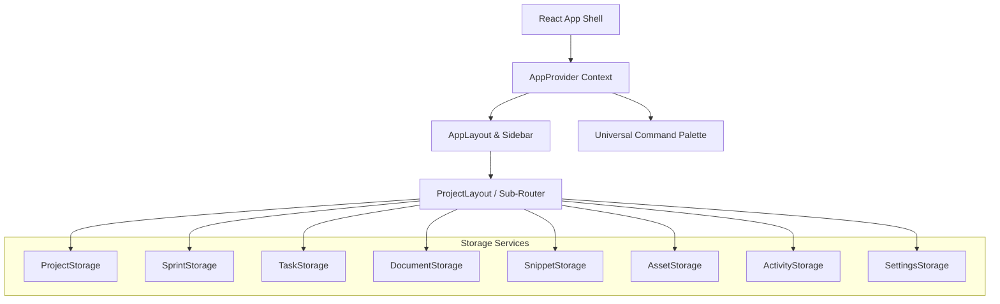

# WIP — Project Operating System: System Documentation & User Guide

Welcome to the full documentation for **WIP (Work In Progress) — Project Operating System**. This document details the architectural layout, core subsystems, user interface screens, and features implemented across the application.

---

## 1. Architectural Overview & Design System

WIP is designed as a SaaS-quality desktop-first project workspace built on a modern frontend stack:
- **Core Technology**: React 18, Vite, TypeScript, and React Router (v6).
- **Styling**: Tailwind CSS for component-level styling, utilizing CSS variables mapped to design tokens (`index.css`) for consistent typography and spacing.
- **State Management**: Built on top of a service layer that interacts directly with browser **LocalStorage**. State is hydrated globally via a React Context API (`AppContext.tsx`) to avoid prop-drilling, enabling smooth, fast state sharing.
- **Visual Theme**: Minimal, clean neutral bases (light mode white/gray surfaces) offset by energy-giving yellow (`#FFE58F`) and red (`#F06277`) brand colors. The visual grid employs card borders (`#E5E7EB`) and subtle, smooth transition micro-animations.

---

## 2. Storage & Service Layer (Data Flow)

To ensure future scalability and potential backend integrations, the application uses an abstracted **Service Layer** pattern under `src/storage/`. Each storage module exposes basic CRUD methods that serialize and deserialize entities to/from JSON strings in `window.localStorage`.

### Services Listing
1. **`ProjectStorage.ts`**: Governs project metadata, favorites status, archived states, and tracks relative templates.
2. **`SprintStorage.ts`**: Coordinates sprint schedules, start/end date ranges, capacity, and current active/completed statuses.
3. **`TaskStorage.ts`**: Manages granular tasks, comments arrays, assignee lists, story point weightings, status columns, and sprint assignments.
4. **`DocumentStorage.ts`**: Stores text and folder hierarchies, pins, and implements a multi-step **Draft Auto-save Buffer** to avoid data loss.
5. **`SnippetStorage.ts`**: Organizes developer code pieces, language tags, categories, and handles code duplication checks.
6. **`AssetStorage.ts`**: Converts uploaded files into serializable `dataUrl` Base64 strings, tracking MIME type classification and file sizes.
7. **`ActivityStorage.ts`**: Aggregates a transactional log of occurrences (e.g. task created, sprint completed, settings saved) to build the workspace history feeds.
8. **`SettingsStorage.ts`**: Manages global configuration options like Workspace Name, Accent Colors, and Sidebar collapsed state.

---

## 3. Core Shell, Layouts & Navigation

The layout architecture provides an immersive operating system feel.

### Sidebar (`src/components/sidebar/`)
- Collapsible navigation panel supporting full width or icon-only compact views.
- Quick shortcut button for the **Universal Command Palette** (`Ctrl+K`).
- Dynamic directories lists containing starred favorite projects and all active, non-archived projects.
- Contextual menu options to trigger project creation directly.

### Universal Command Palette (`src/components/command/`)
- Powered by `cmdk`. Triggered globally via `Ctrl+K` or `Cmd+K`.
- Categorized lookup:
  - **Quick Actions**: Add Task, Create Project, Navigate home, etc.
  - **Contextual Search**: Filters through projects, documents, tasks, and snippets concurrently.
  - **Keyboard Navigation**: Fully optimized arrow key traversal and `Enter` selection.

---

## 4. Workspace Global Pages

### 4.1 Dashboard
- **Aggregate KPI Stats**: Displays active projects count, total tasks backlog, completed tasks count, and number of active sprints.
- **Starred Favorites**: Quick-launch pins to projects that are favorited.
- **Workspace In-Progress Feed**: Active projects progress bars computed dynamically using task completion percentages.
- **Activity Log**: Workspace-wide audit timeline displaying the latest actions.

### 4.2 Universal Search
- An extended standalone page providing search across every entity type (Planning sections, backlogs, assets, documents, snippets, sprints).
- Grouped type-based filters allowing developers to isolate only code snippets or documents matching the search text.

### 4.3 Workspace Settings
- Custom workspace naming and accent color configuration.
- Date format configurations (`yyyy-MM-dd`, `dd/MM/yyyy`, etc.) used application-wide.
- **Import/Export Engine**: Exports the entire LocalStorage database as a single JSON backup file. Importing files immediately parses and re-populates the LocalStorage state, triggering a clean page reload.
- **Danger Zone**: Hard reset database wipe.

---

## 5. Project Pages & Inside Features

When entering a project, the interface mounts the `ProjectLayout` containing sub-routes across 11 project-specific workspaces:

### 5.1 Project Overview
- A snapshot page featuring project health (computed aggregate task percentage).
- Active sprint focus area highlighting current objectives, date range, and remaining capacity.
- Immediate quick-action links (e.g. Write Docs, Plan Sprint, Upload Asset).
- Prioritized task summary listing critical and high-priority backlog tasks.

### 5.2 Project Planning
- Long-form markdown notebooks outlining Project Vision, Goals, Architecture Notes, and Ideation.
- Implements **Debounced Autosaving**: Typing dynamically saves local changes to a draft state, committing to persistence after 1.5 seconds of inactivity.

### 5.3 Project Backlog
- Core task creation and modification interface.
- Filters tasks by text match or Priority badges.
- Includes a collapsible details drawer presenting story points, assignee initials, labels, and acceptance criteria.
- Supports instant task deletion, sprint assignment, and comments insertion.

### 5.4 Project Sprints
- Timeline planning container to spin up sprint milestones.
- Sprints are categorized by workflow states: `Planning`, `Active`, and `Completed`.
- Sprints feature capacity hours, goals, and an expandable task preview list.
- Moving a sprint to "Active" updates the project dashboard's sprint tracker.

### 5.5 Board (Kanban View)
- A drag-and-drop workspace powered by `@hello-pangea/dnd`.
- Columns match status types: `Backlog`, `To Do`, `In Progress`, `Review`, `Testing`, and `Done`.
- Dragging a card between columns triggers transactional log updates and immediately updates task statuses.
- Includes quick-add cards inputs under headers.

### 5.6 Project Timeline
- Visual Gantt chart depicting sprint calendars.
- Automatically calculates offset calculations from project start/end bounds.
- Renders timeline bars color-coded by sprint status (planning, active, completed) aligned across calendar months.

### 5.7 Docs (Markdown Center)
- Dedicated dual-pane wiki interface.
- **Sidebar Tree**: Lists document files and folders with options to pin critical articles.
- **Autosaving Markdown Editor**: Supports writing and updating docs. When modifications occur, a draft buffer (`wip_draft_<doc_id>`) is created. If the session terminates, a draft restoration banner prompts the user to restore their work.

### 5.8 Assets Hub
- Project file repository supporting images, videos, PDFs, and compressed archives.
- **Drag and Drop Uploader**: Dragging files over the dropzone converts media into serializable base64 strings saved under the assets database.
- Grid & List view layout toggles, search, and type-specific filter badges.
- Double-clicking opens a detailed sidebar preview panel with metadata info, direct file download links, and pinning actions.

### 5.9 Snippets (Developer Library)
- Dual-pane developer repository for storing reusable helper functions, configuration setups, and CLI scripts.
- Supports **Syntax Highlighting** via `react-syntax-highlighter` mapping color patterns by language.
- Quick copy button for fast clipboard actions.

### 5.10 Project Analytics
- Metric dashboard utilizing `recharts`:
  - KPI boxes reporting story points velocity.
  - Pie charts illustrating task status distributions.
  - Horizontal bar charts for priority counts.
  - Horizontal bar chart tracking label frequency.
  - Vertical bar charts comparing planned vs. completed story points across sprints.
  - Area charts measuring workspace action frequencies over the last 14 days.

### 5.11 Project Settings
- Edit project title, descriptions, icon badges, and project colors.
- Provides statistics summaries reporting totals of tasks, docs, and assets.
- Lifecycle actions: Duplicate Project, Toggle archived status, and Permanent Project Deletion.
